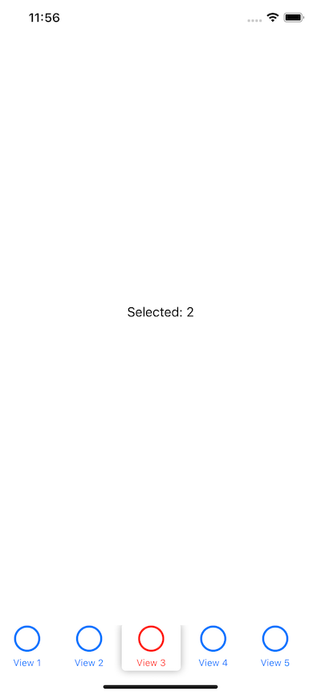

# IRScrollableTabView

## Purpose

A tab view where the tab bar can be scrolled and thus provide many tab items. 
The selected index is provided through the service and can be used to determine the destination view to display. 
It is realized in pure SwiftUI and shows how PreferenceKeys can be used to adopt a container to its children's sizes.

## Prerequisites

iOS 13 / macOS 10.15

## Installation

Use the Swift Package Manager with the repo's URL and add it to your project:
	git@github.com:innoreq/IRScrollableTabView.git / from: 1.0.0

## Usage

Create a list of tab items:

	let scrollableTabItems: [IRScrollableTabView.Item] = [
	
		IRScrollableTabView.Item(title: "View 1"),
		IRScrollableTabView.Item(title: "View 2"),
		IRScrollableTabView.Item(title: "View 3"),
		IRScrollableTabView.Item(title: "View 4"),
		IRScrollableTabView.Item(title: "View 5"),
		IRScrollableTabView.Item(title: "View 6"),
		IRScrollableTabView.Item(title: "View 7"),
		IRScrollableTabView.Item(title: "View 8"),
		IRScrollableTabView.Item(title: "View 9"),
		IRScrollableTabView.Item(title: "View 10"),
	]

Create the service and add it to the environment. Provide the initially selected index to the service, as well as the tab items and a closure that provides the view to display based on the selection:

	
		let contentView = ContentView()
			.background(Color.clear)
			.environmentObject(IRScrollableTabView.Service(tabItems: scrollableTabItems,
														   initialSelectedIndex: 0,
														   selectionClosure: { index in
															
															AnyView(Text("Selected: \(index)"))
			}))
	

Use the view:

	struct ContentView: View {	
	
		var body: some View {
	    
			IRScrollableTabView()
	    }
	}
	
	
## Configuration

You can provide a configuration with settings for most of the view's parts:

	IRScrollableTabView(configuration: IRScrollableTabView.Configuration)
	
where:

	IRScrollableTabView.Configuration(separatorLineColor: Color = .clear,
					destinationBackgroundColor: Color = .clear,
					indicatorForegroundColor: Color = .white,
					tabItemSelectedColor: Color = .red,
					tabItemUnselectedColor: Color = .blue,
					itemWidth: CGFloat = 70,
					itemSpacing: CGFloat = 10,
					indicatorEnlargement: CGFloat = 6,
					indicatorCornerRadius: CGFloat = 5,
					indicatorShadowRadius: CGFloat = 5,
					animationDuration: Double = 0.3,
					tabItemImageFont: Font = .largeTitle,
					tabItemTextFont: Font = .caption)

## Notes

None.
